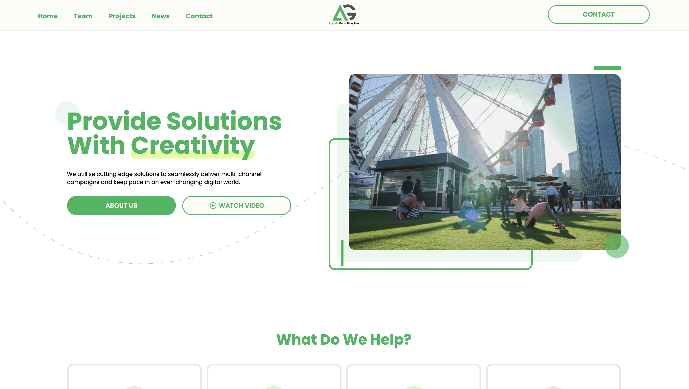

# Website Design for Agenda Consulting Asia

- [Website Design for Agenda Consulting Asia](#website-design-for-agenda-consulting-asia)
  - [Overview](#overview)
  - [📋 About Copyrights](#-about-copyrights)
  - [🌟 Getting Started](#-getting-started)
    - [1. Install Dependencies](#1-install-dependencies)
    - [2. `.env` setup](#2-env-setup)
    - [3. Running NextJS Dev Sever](#3-running-nextjs-dev-sever)
  - [⚙️ Build with](#️-build-with)

## Overview

Agenda is one of the previous companies I've worked for and my favorite one. As a beginner of `NextJS` and `Sanity`, I decided to launch a mini-project to practise and strengthen my skillsets by revamping their exsiting website.



🔗 Preview URL : [https://agconsulting.vercel.app/](https://agconsulting.vercel.app/)

- ✔️ Created a brand new identity design for the company
- ✔️ Followed UI/UX workflow from design on `Figma` to development with `NextJS`
- ✔️ Fully responsive website
- ✔️ Built with `Sanity`, a headless CMS that can easily manage content
- ✔️ Deploy on `Vercel` with `NextJS`, which provides a quick and smooth hosting

🔗 UI Design on Figma: [https://www.figma.com/file/5aqiAkXVVZQxTn0veIkHGj/Agenda?node-id=0%3A1&t=67c9yJPbtLvzjaZe-1](https://www.figma.com/file/5aqiAkXVVZQxTn0veIkHGj/Agenda?node-id=0%3A1&t=67c9yJPbtLvzjaZe-1)

## 📋 About Copyrights

This project is based on the content and structure from Agenda's [official website](https://agconsulting.asia/). The intention of this project is for **self-study purpose only**. Please note that the copyright of the content and all images belongs to **Agenda Consulting Asia**.

## 🌟 Getting Started

This project is using `NextJS` as a front-end framework with `Sanity` as headless CMS to provide data.

A `PROJECTID` from `Sanity` and `GOOGLE_MAP_KEY` are required to set up the project.

### 1. Install Dependencies

After cloning from GitHub, run `npm install` to install all dependencies this project will need.

### 2. `.env` setup

Create a `.env` file and enter the ID and key by following the template shown below.

```sh
NEXT_PUBLIC_PROJECTID = **Your own ID from Sanity**
NEXT_PUBLIC_GOOGLE_MAP_KEY = **Google map Key**
```

### 3. Running NextJS Dev Sever

By running `npm run dev`, you can now preview the website on `http://localhost:3000/`

## ⚙️ Build with

- [NextJS](https://nextjs.org/)
- [Tailwindcss](https://tailwindcss.com/)
- [Framer-motion](https://www.framer.com/motion/)
- [DaisyUI](https://daisyui.com/)
- [Sanity](https://www.sanity.io/)
